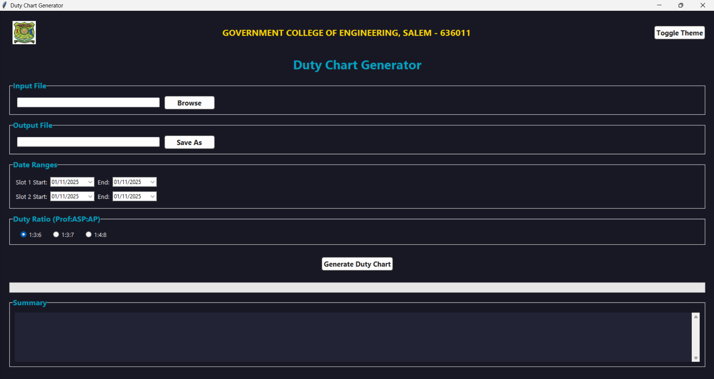
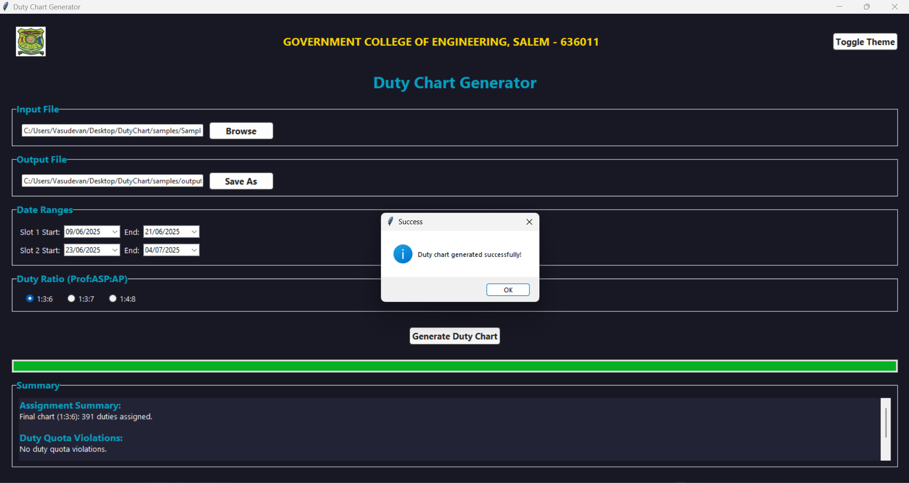
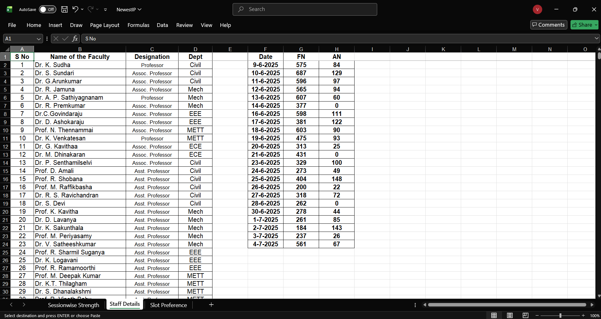
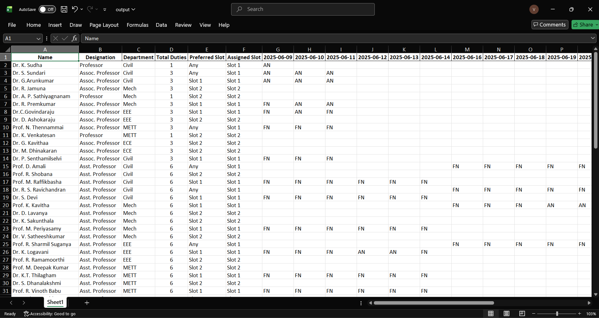

# Duty Chart Generator – GCE Salem

**Automates exam duty assignment** for **50+ staff** across **30+ dates** using **70:30 ratio**, **slot preferences**, and **designation hierarchy**.

**Used by Government College of Engineering, Salem** exam cell.  
**Saves 12+ hours** per exam schedule.


---

## Features

- **Modern GUI** with dark/light theme toggle
- **Excel input/output** (`.xlsx`)
- **Fuzzy name matching** between staff list and preferences
- **Designation hierarchy**: Professor to Assoc. Professor to Asst. Professor to A.P(Contract)
- **Flexible duty ratios**: `1:3:6`, `1:3:7`, `1:4:8`
- **70:30 permanent:guest** staff ratio enforcement
- **Slot preference** enforcement with violation reporting
- **Real-time progress bar** and summary
- **Modular architecture**: `core/`, `gui/`, `config/`

---

## Screenshots

| GUI (Dark Mode) | Input Selection | Sample Input | Sample Output |
|------------------|------------------|--------------|---------------|
|  |  |  |  |

---

## Sample Files

| File | Description |
|------|-----------|
| [SampleInput.xlsx](./samples/SampleInput.xlsx) | Test input with 3 sheets: `Session Strength`, `Staff List`, `Slot Preference` |
| [output.xlsx](./samples/output.xlsx) | Generated duty chart with totals and violations |

---

## How to Run

```bash
# 1. Clone the repo
git clone https://github.com/YOUR_USERNAME/dutychart.git
cd dutychart

# 2. Create virtual environment
python -m venv .venv
.venv\Scripts\activate

# 3. Install dependencies
pip install -r requirements.txt

# 4. Run the app
python main.py

```
---

## Project Structure

DutyChart/
├── core/          to Business logic (parser, matcher, scheduler)
├── gui/           to Tkinter interface
├── config/        to Logging setup
├── assets/        to Logo
├── samples/       to Test input/output
├── screenshots/   to Demo images
├── main.py        to Entry point
└── requirements.txt

## Tech Stack

- **Python 3.9+**
- **Pandas** – Data processing
- **OpenPyXL** – Excel I/O
- **Tkinter** – Native GUI
- **Pillow** – Image handling
- **tkcalendar** – Date picker

---

## Author

**Vasudevan**  
CSE Student, Government College of Engineering, Salem  

[GitHub](https://github.com/Vasu-Dev-arch) | [LinkedIn](https://linkedin.com/in/vasudevan-j) | [Portfolio](https://vasudev-portfolio.netlify.app)